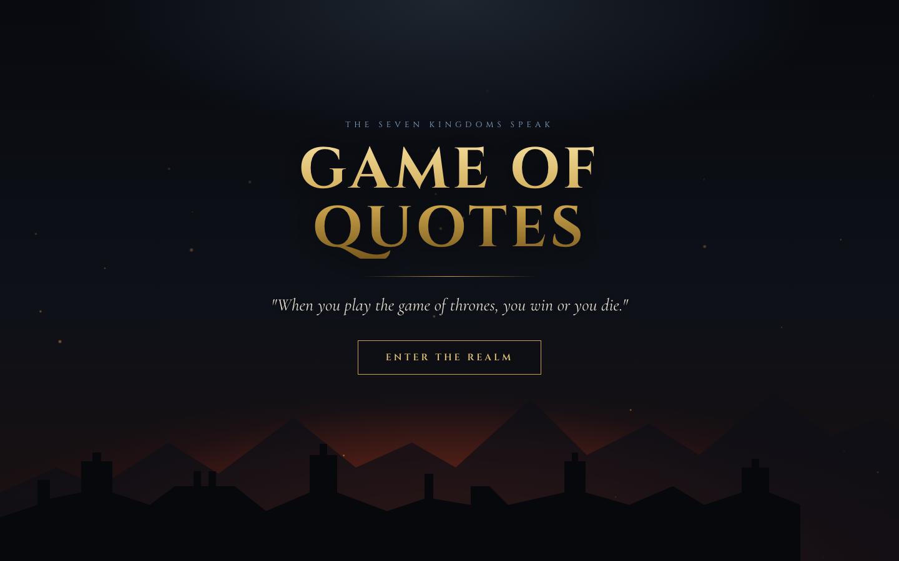
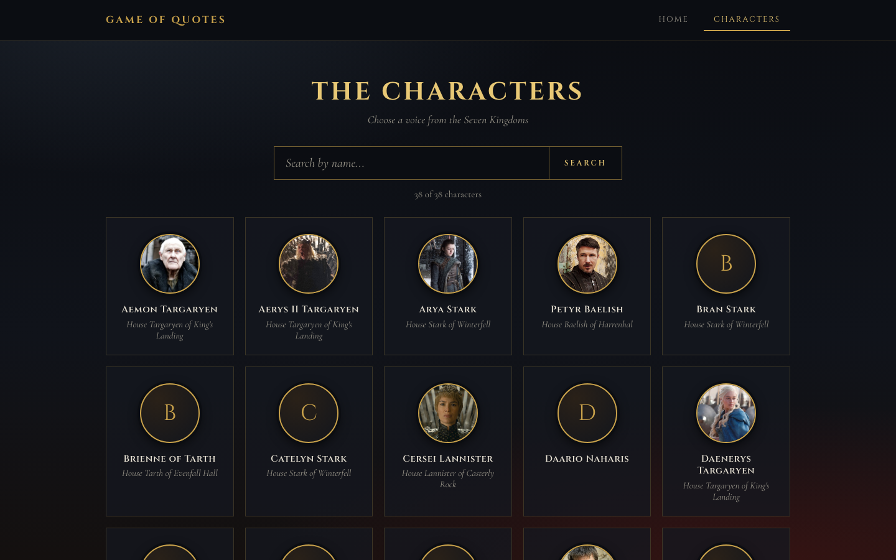
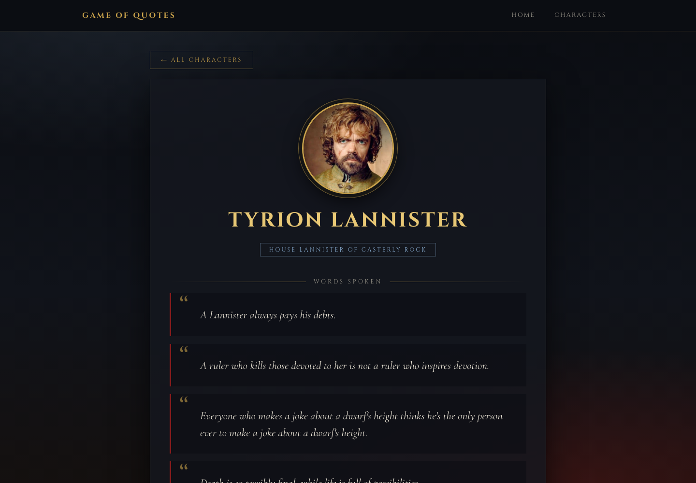

# Project_2 Game of Quotes

`Search for your favorite Game Of Thrones character's quotes with this simple react web page.`

1.  Overview
2.  Installation
3.  Technologies Used
4.  How to use
5.  The Components
6.  Project Structure
7.  Design
8.  Timeline
9.  Wins and Blockers
10. Future content and improvements
11. Key Learnings
12. Original Planning Notes

## Overview

Game of Quotes is a web application that allows users to search for quotes from their favorite characters of the Game of Thrones TV series. It uses the Game of Thrones Quotes API to fetch character information and their quotes. This was a 5-day solo project and my first experience of using a public API and building the front-end in React.

You will find the deployed version [here](https://game-of-quotes.netlify.app/)



| Characters | Character |
| --- | --- |
|  |  |

# Installation

You'll need [Node.js](https://nodejs.org/) installed (run `node -v` to check). Then:

1. Clone this repository: `git clone <repository-ssh-url>`
2. In the root directory, run `npm install` to install the dependencies.
3. Run `npm run dev` to start the dev server.
4. Open the local URL printed in the terminal (usually http://localhost:5173).

Other scripts:

- `npm run build` creates a production build in `dist/`
- `npm run preview` serves the production build locally

### Deployment

The app is deployed on Netlify. Use the build command `npm run build` and the publish directory `dist`. `public/_redirects` sends every route to `index.html` so refreshing a page like `/characters` works with React Router.

## Technologies Used

- React: A JavaScript library for building user interfaces
- React DOM: A package for rendering React components to the DOM (Document Object Model)
- Axios: A library for making HTTP requests from the browser
- Sass: A CSS extension language that adds features like variables, nesting, and mixins to make styling easier
- Vite: A fast development server and build tool for modern web applications
- Cinzel and Cormorant Garamond (Google Fonts) for the typography

**API Used**:

- Game Of Thrones Quotes API - https://gameofthronesquotes.xyz/\

**Dev tools**:

- VS code
- Git
- Github
- Google Chrome dev tools
- Netlify (deployment)

## How to use

On the **characters page**, users can browse every character as a card with a portrait and house, and filter the list by typing in the search bar. Pressing "Enter" or clicking "Search" jumps straight to a character when the search narrows to a single match or an exact name. Clicking a card opens that character's page.

On the **character page**, users can read every quote for the selected character, along with their portrait, name and house. The "All characters" button returns to the list.

## The components

**Homepage**: the landing page. A castle skyline, rising embers and the "Game of Quotes" title are built entirely from CSS and inline SVG (no external wallpapers), with an "Enter the Realm" button leading to the characters.

**Header**: a sticky navigation bar, hidden on the homepage. The links are generated from the navigationLinks array and rendered with react-router-dom's NavLink, so the current page is highlighted.

**Characters**: a search page that filters characters by name (case-insensitive, partial matches) and shows them as a grid of cards.

**CharacterDetails**: a detail page for the character selected via the slug in the URL, showing their portrait, name, house and a card for each quote.

**Avatar**: a round portrait that falls back to a monogram when an image is missing or fails to load.

**Loader**: the "Summoning ravens..." loading state shown while data is fetched.

## Project Structure

```
src/
  App.jsx                  routes
  consts.js                API url and character image map
  global.scss              design tokens (CSS variables) and shared styles
  components/              Avatar, Header, Loader
  hooks/                   useCharacters, useCharacterDetails (data fetching)
  pages/                   Home, Characters, CharacterDetails
docs/screenshots/          images used in this README
public/                    favicon and Netlify _redirects
```

## Design

The look is dark and cinematic, in keeping with the show: obsidian backgrounds, aged gold for headings and accents, crimson and ember tones from the south and an icy blue for highlights. Colours and fonts are defined once as CSS variables in `global.scss`. Headings use Cinzel and body text uses Cormorant Garamond. The backgrounds are made with CSS gradients and inline SVG, so the app doesn't depend on external wallpaper links. Animations are disabled for users who prefer reduced motion, and the layout is responsive down to phone width.

## Timeline

### Day 1:

I spent most of my time searching for the appropriate API to use and choosing the app's functionalities. I eventually decided on creating a website for a very popular and one of my favorite tv shows Game Of Thrones. I wanted the app to include a homepage for the character names, a search bar, an individual page for each character and as a strech goal, if you are logged in, an add more quotes page. I ended the day with doing some wireframing using Excalidraw and looking at the documentation of the API, to have an idea of how I would access the data.

### Day 2 and 3:

On the second day, I started with the characters page creation. First I used two hook React functions *useState and *useEffect to grab the data from the external API and console log it so that I could better understand how to handle the data.


Then in the return statement I mapped through the data to grab the character names and render them in the homepage.


The search function was a bit trickier, as I wanted to filter throught the list of names, when searching and only show the name I searched for and I also wanted to be able to type in lowercase or uppercase and still get the name. This was my final function:


I then updated my return statement so that it would show the filtered data on the page. I then moved on to making the logic for the onclick function, so that when I searched for a name and pressed enter or click the search button or the name, I would then be redirected to that character's page. I also added some logic so that you don't have to write the whole character's name to search for him and used a form for the search bar. By typing some letters and not the whole name, you could still navigate to the character's page if there was only his name left on the filtered list, meaning if the length of the names was 1.


My return statement:


### Day 4 and 5:

The fourth day was spent on creating the the individual character's page and a navbar. I first used the useEffect and useParams hooks to get the individual character's page from their slug and then a return statement to render the data on the quotes.


I also added some conditions and a button with a link back to the homepage.

JSX: 

Finishing off I added a navbar with links for the homepage and quotes page and some additional links with their functionalities added in the future. I used SCSS for the styling and finally the app was deployed with Netlify.

Homepage: 

Characters page: 

Quote page: 

### Redesign:

After the first version I came back to the project to give it a full visual redesign. The character list became a grid of cards with portraits and houses, search now filters as you type, each quote has its own card, and broken portraits fall back to a monogram. The search logic was also simplified (it now derives the filtered list instead of storing it in state), so the code screenshots above show the original first version.

## Wins and Blockers

A win was making it possible to search for a character by pressing enter, if it is the only name filtered in the list, without having to write the whole name and also adding some conditional rendering if the characters had no available information for their houses.

Figuring out how to manipulate the data from the API and getting the search bar to only show the name you typed on the page and filter out the others was probably the most challenging part.

## Future content and improvements

Ideas for the future: let users register, log in and add, edit or delete their own quotes, and bring back the original quiz idea (see below).

### Update

A homepage was added as an entry point and the styling was made responsive across devices. The whole UI was later redesigned with a darker, more atmospheric Game of Thrones look: a gold, crimson and ice-blue palette, new typography, CSS/SVG backgrounds instead of hotlinked wallpapers, a card grid for characters and individual quote cards.

## Key Learnings

This project greatly increased my knowledge about consuming and manipulating APIs and as it was my first React project, provided me with a lot of practice about react hooks like useState and useEffect.

## Original Planning Notes

This project was initially going to be a Game Of Thrones quiz. It would provide the user with a total of 10 quotes where he had to select the correct character associated with each quote by picking the correct character image or name, scoring points if they got it right or losing if they were wrong. Due to unforseen time constraints during that project week, I decided I would do something simpler and leave the more complicated functionalities for my next bigger project.
